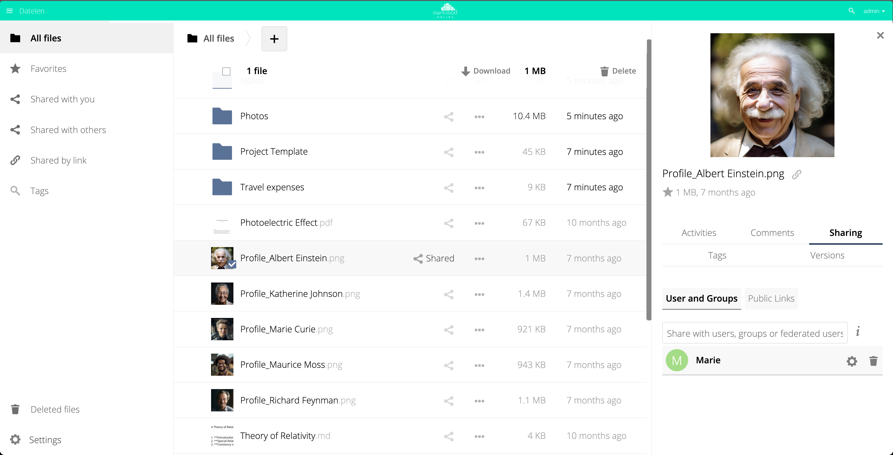

# owncloud.online

**Dateiablage, Freigaben und Zusammenarbeit auf dem eigenen Server.**
owncloud.online ist ein Fork von [ownCloud Core](https://github.com/owncloud/core)
mit PHP-8.4-Kompatibilität, eigenem Design und einer gepflegten Sicherheitslage.

## Dokumentation

Die vollständige Dokumentation steht auf **<https://docs.owncloud.online>** —
Installation, Betrieb, Administration, Plugins und Entwicklung. Die Inhalte
stammen aus dem Ordner [`docs/`](docs/) dieses Repositorys; eine Änderung dort
erscheint nach dem nächsten Build automatisch auf der Doku-Seite.

## Was es kann

* **Daten ablegen** — Dateien, Kontakte und Kalender auf einem Server Ihrer Wahl.
* **Daten abgleichen** — zwischen Arbeitsplatz, Telefon und Web, auch für große
  Dateien: Uploads laufen gestückelt und lassen sich fortsetzen.
* **Daten teilen** — intern per Gruppe oder nach außen per Link, mit Passwort,
  Ablaufdatum und Berechtigungen bis auf Dateiebene.
* **Erweiterbar** — rund 30 gepflegte Plugins aus dem eigenen Market:
  Volltextsuche, Virenprüfung, Verschlüsselung, ONLYOFFICE, S3-Speicher,
  LDAP-Anbindung, Zwei-Faktor-Anmeldung und mehr.
* **Verschlüsselung** — HTTPS im Transport, optional serverseitige
  Verschlüsselung des Speichers.
* **Barrierefreiheit** — laufend gegen WCAG 2.1 AA geprüft und nachgebessert.

## Installation

Siehe [Installation](https://docs.owncloud.online/installation/) in der
Dokumentation. Anleitungen gibt es für Linux-Server, Webhosting und lokale
Testinstanzen.

## Entwicklung

Für einen lokalen Build brauchen Sie **Composer v2** sowie `node` (v14 oder
neuer) und `yarn`. Bringt Ihre Distribution nur Composer v1 mit, installieren
Sie v2 von Hand.

### Commit-Nachrichten

Ein CI-Job prüft, ob die Commit-Nachricht dem Format
[Conventional Commits](https://www.conventionalcommits.org/) entspricht. Ist sie
es nicht, wird die CI rot und die Historie muss angepasst werden.

Mindestens nötig sind `type` und `description`. Gültige Typen:

`feat:`, `fix:`, `docs:`, `style:`, `refactor:`, `test:`, `build:`, `perf:`,
`ci:`, `chore:`, `revert:`

Andere Typen lehnt die Prüfung ab — `l10n:` etwa ist keiner; nutzen Sie dafür
`chore(l10n):`.

## Unterstützung

Fragen und Fehlermeldungen: [Issues](https://github.com/BWTECH-github/owncloud.online/issues)
oder direkt an [BW.Tech](https://bw.tech).

## Herkunft und Lizenz

owncloud.online baut auf [ownCloud Core](https://github.com/owncloud/core) auf.
Der Dank für die ursprüngliche Arbeit gehört der ownCloud GmbH und der
ownCloud-Gemeinschaft; dieser Fork wird davon unabhängig von der BW-Tech GmbH
gepflegt. Es gelten weiterhin die Lizenzbedingungen des Ursprungsprojekts
(AGPLv3), siehe [COPYING](COPYING).

---
Gepflegt von [BW.Tech](https://bw.tech)
