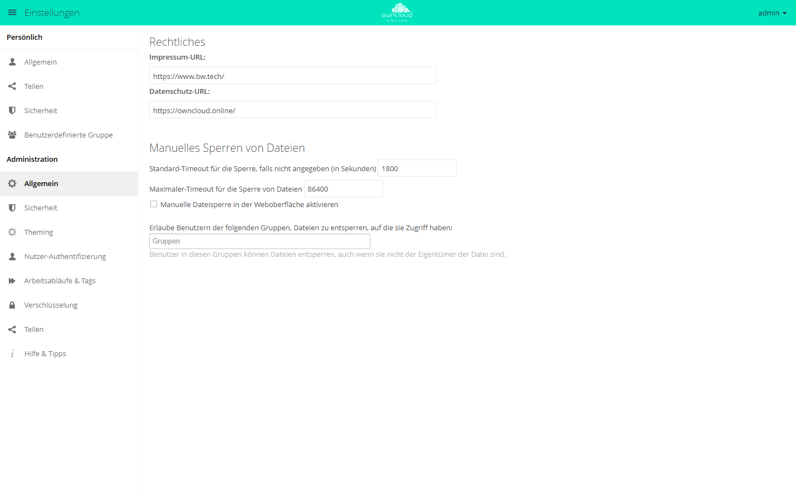
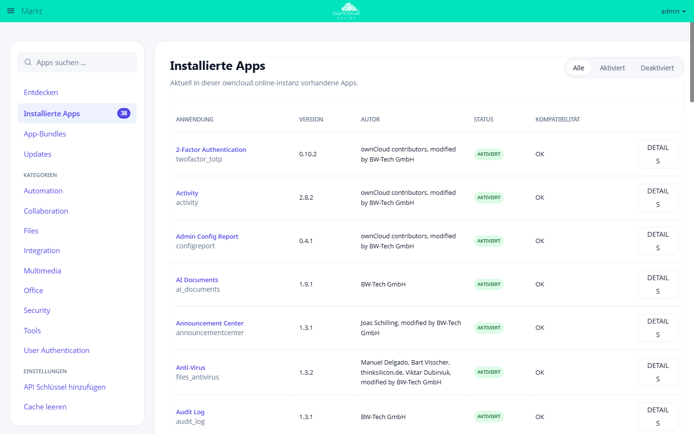

# Administration

Die Administration umfasst Systemzustand, Apps, Cron, Cache, Datenbank, Sicherheit, Backups und Updates.

## Tägliche Checks

```bash
sudo -u www-data php8.4 /var/www/owncloud.online/occ status
sudo -u www-data php8.4 /var/www/owncloud.online/occ app:list
sudo -u www-data php8.4 /var/www/owncloud.online/occ background:queue:status
```

## Wichtige Pfade

| Pfad | Zweck |
| --- | --- |
| `/var/www/owncloud.online` | Anwendungscode |
| `/var/owncloud-online-data` | Benutzerdaten |
| `/var/log/apache2` | Apache Logs |
| `/var/log/php8.4-fpm.log` | PHP-FPM Logs |
| `config/config.php` | Systemkonfiguration |

## Die Verwaltungsoberfläche



Erreichbar über das Benutzermenü rechts oben unter *Einstellungen*. Die linke
Spalte trennt persönliche Einstellungen von der Administration; alles unterhalb
von *Administration* wirkt auf die ganze Instanz.

## Apps und Markt



Der Markt zeigt unter *Installierte Apps*, was in dieser Instanz vorhanden ist,
mit Version, Autor, Zustand und einem Hinweis, ob die App zur Serverversion
passt. *Updates* listet die Apps, für die eine neuere Fassung im Katalog liegt.

Steht dort der Hinweis, dass Installieren und Aktualisieren nicht unterstützt
wird, fehlt dem Webserver das Schreibrecht auf das `apps`-Verzeichnis — dann
ist der Weg über `occ` beziehungsweise über das Paket der richtige.
