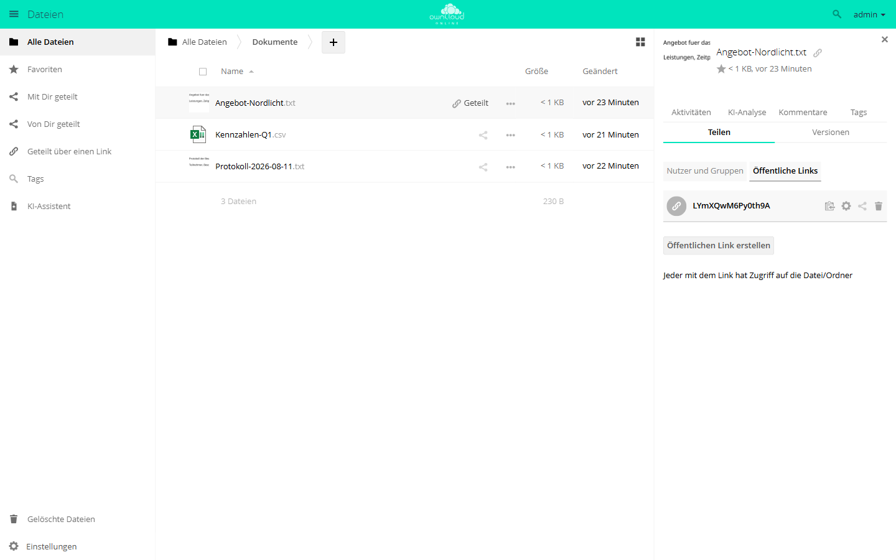

# Freigaben steuern

owncloud.online bündelt alle Freigabe-Regeln in einem Verwaltungsbereich. Die
Schalter dort schreiben App-Konfigurationswerte, deshalb lässt sich praktisch
jede Einstellung genauso gut per `occ config:app:set` setzen — das ist der
Weg für Erstinstallationen, Skripte und reproduzierbare Kundenkonfigurationen.
Die einzige Ausnahme auf dieser Seite ist die Liste der vertrauenswürdigen
Verbund-Server: Sie liegt in einer eigenen Datenbanktabelle, nicht in der
App-Konfiguration.

Diese Seite listet zu jedem Schalter den zugehörigen Schlüssel und beschreibt,
was der Server damit tatsächlich durchsetzt.

## Wo die Einstellungen liegen

Menüpfad: **Einstellungen → Administration → Teilen**.

Der Abschnitt wird aus mehreren Panels zusammengesetzt. Welche davon erscheinen,
hängt davon ab, welche Apps aktiv sind:

| Abschnitt | Herkunft | erscheint |
| --- | --- | --- |
| **Teilen** | Kern (`settings/templates/panels/admin/filesharing.php`) | immer |
| **Vom Teilen ausgeschlossene Gruppen** | App `files_sharing` | immer (die App ist standardmäßig aktiv) |
| **Federated-Cloud-Sharing** | App `federatedfilesharing` | nur wenn die App aktiv ist |
| **Federation** | App `federation` | nur wenn die App aktiv ist |
| **Guests** | App `guests` | nur wenn die App aktiv ist |

Fast alle Schlüssel des Hauptabschnitts liegen in der App `core`, nicht in
`files_sharing`. Die Verbund- und Gruppenlisten-Schlüssel liegen dagegen in
`files_sharing`. Beim Setzen per `occ` ist der App-Name deshalb genau zu
beachten.

Die Ja/Nein-Schalter des Hauptabschnitts **Teilen** speichern die Zeichenketten
`yes` und `no` — nicht `1` und `0` (`settings/js/admin.js`). Für die Panels der
Apps `guests` und `federation` gilt das nicht, siehe die jeweiligen Abschnitte
weiter unten.



## Freigabe überhaupt erlauben

Der oberste Schalter **Apps die Benutzung der Share-API erlauben** ist der
Hauptschalter. Steht er auf `no`, blendet die Oberfläche alle weiteren
Freigabe-Optionen aus und der Server weist Zugriffe auf öffentliche Links ab
(`apps/files_sharing/lib/Middleware/SharingCheckMiddleware.php`).

| Schlüssel | App | Standard |
| --- | --- | --- |
| `shareapi_enabled` | `core` | `yes` |

```bash
sudo -u www-data php8.4 occ config:app:set core shareapi_enabled --value no
```

Die untergeordneten Werte bleiben dabei erhalten; sie werden lediglich nicht
mehr ausgewertet. Wird der Hauptschalter wieder auf `yes` gestellt, gilt sofort
wieder die zuvor gespeicherte Konfiguration.

## Öffentliche Links

**Benutzern erlauben, Inhalte über Links zu teilen** entscheidet, ob überhaupt
Link-Freigaben angelegt werden dürfen. Ist der Wert `no`, lehnt der Server das
Anlegen ab (`lib/private/Share20/Manager.php`, `linkCreateChecks`) und der
Zugriff auf bestehende Links wird blockiert.

| Beschriftung | Schlüssel (App `core`) | Standard |
| --- | --- | --- |
| Benutzern erlauben, Inhalte über Links zu teilen | `shareapi_allow_links` | `yes` |
| Öffentliches Hochladen erlauben | `shareapi_allow_public_upload` | `yes` |
| Benutzern erlauben, E-Mail-Benachrichtigungen für freigegebene Dateien zu senden | `shareapi_allow_public_notification` | `no` |
| Sprache für die Benachrichtigungs-Mail für geteilte Dateien | `shareapi_public_notification_lang` | `owner` |
| Benutzern erlauben, Inhalte über die sozialen Medien zu teilen | `shareapi_allow_social_share` | `yes` |

`shareapi_allow_public_upload` auf `no` lässt nur noch reine Lese-Links zu: Der
Server verwirft jede Link-Freigabe, die eine der Berechtigungen Anlegen, Ändern
oder Löschen enthält. Der Sprachschlüssel nimmt entweder einen Sprachcode oder
den Sonderwert `owner` — dann wird die Sprache des Eigentümers der Freigabe
verwendet (Beschriftung *Sprache des Anwenders*).

```bash
sudo -u www-data php8.4 occ config:app:set core shareapi_allow_links --value yes
sudo -u www-data php8.4 occ config:app:set core shareapi_allow_public_upload --value no
```

## Passwortzwang für Links

Der Passwortzwang wird nicht pauschal gesetzt, sondern je Link-Rolle. Der Server
vergleicht die Berechtigungen der Freigabe mit genau definierten Kombinationen
(`lib/private/Share20/Manager.php`, `passwordMustBeEnforced`):

| Beschriftung | Schlüssel (App `core`) | Standard | greift bei |
| --- | --- | --- | --- |
| Passwort für "nur lesen" Links erzwingen | `shareapi_enforce_links_password_read_only` | `no` | Lesen |
| Passwort für "lesen+schreiben" Links erzwingen | `shareapi_enforce_links_password_read_write` | `no` | Ordner: Lesen + Anlegen |
| Passwort für "lesen+schreiben+löschen" Links erzwingen | `shareapi_enforce_links_password_read_write_delete` | `no` | Ordner: Lesen + Ändern + Anlegen + Löschen, und Datei: Lesen + Ändern |
| Passwort für Upload-Links (File Drop) erzwingen | `shareapi_enforce_links_password_write_only` | `no` | nur Anlegen |

Die Prüfung greift beim Anlegen und beim Ändern einer Link-Freigabe. Wer alle
öffentlichen Links absichern will, muss alle vier Schlüssel setzen — ein
einzelner deckt nur seine Rolle ab:

```bash
sudo -u www-data php8.4 occ config:app:set core shareapi_enforce_links_password_read_only --value yes
sudo -u www-data php8.4 occ config:app:set core shareapi_enforce_links_password_read_write --value yes
sudo -u www-data php8.4 occ config:app:set core shareapi_enforce_links_password_read_write_delete --value yes
sudo -u www-data php8.4 occ config:app:set core shareapi_enforce_links_password_write_only --value yes
```

Die vier Schalter erzwingen nur, dass überhaupt ein Passwort gesetzt wird. Wie
stark dieses Passwort sein muss, regelt die Passwortrichtlinie, siehe unten.

## Ablaufdatum

Es gibt vier unabhängige Sätze von Ablauf-Einstellungen: für Links, für
Benutzer-, für Gruppen- und für Verbund-Freigaben. Jeder Satz besteht aus drei
Schlüsseln — einschalten, Anzahl Tage, erzwingen.

| Freigabetyp | Standardmäßiges Ablaufdatum setzen | Ablauf nach … Tagen | Als spätestes Ablaufdatum erzwingen |
| --- | --- | --- | --- |
| Öffentliche Links | `shareapi_default_expire_date` | `shareapi_expire_after_n_days` | `shareapi_enforce_expire_date` |
| Benutzer-Freigaben | `shareapi_default_expire_date_user_share` | `shareapi_expire_after_n_days_user_share` | `shareapi_enforce_expire_date_user_share` |
| Gruppen-Freigaben | `shareapi_default_expire_date_group_share` | `shareapi_expire_after_n_days_group_share` | `shareapi_enforce_expire_date_group_share` |
| Verbund-Freigaben | `shareapi_default_expire_date_remote_share` | `shareapi_expire_after_n_days_remote_share` | `shareapi_enforce_expire_date_remote_share` |

Alle Schlüssel liegen in der App `core`. Die Schalter stehen im Standard auf
`no`, die Tageswerte auf `7`.

Wichtig ist die Reihenfolge: Der Erzwingen-Schalter wird nur ausgewertet, wenn
der zugehörige Standardablauf eingeschaltet ist. Im Code steht die Bedingung
ausdrücklich als Und-Verknüpfung (`shareApiLinkDefaultExpireDateEnforced` und
die entsprechenden Methoden für Benutzer-, Gruppen- und Verbund-Freigaben in
`lib/private/Share20/Manager.php`).

```bash
sudo -u www-data php8.4 occ config:app:set core shareapi_default_expire_date --value yes
sudo -u www-data php8.4 occ config:app:set core shareapi_expire_after_n_days --value 14
sudo -u www-data php8.4 occ config:app:set core shareapi_enforce_expire_date --value yes
```

Abgelaufene Freigaben verschwinden nicht sofort, sondern werden von einem
Hintergrund-Job entfernt, der einmal pro Tag läuft
(`apps/files_sharing/lib/ExpireSharesJob.php`). Ohne funktionierenden Cron
bleiben sie bestehen, siehe [Hintergrund-Jobs (Cron)](background-jobs.md).

## Weiterteilen

**Weiterverteilen erlauben** steuert, ob Empfänger einer Freigabe diese
ihrerseits weitergeben dürfen.

| Schlüssel | App | Standard |
| --- | --- | --- |
| `shareapi_allow_resharing` | `core` | `yes` |

```bash
sudo -u www-data php8.4 occ config:app:set core shareapi_allow_resharing --value no
```

Unabhängig davon können Link-Freigaben grundsätzlich keine Weitergabe-Rechte
tragen: Der Server weist eine Link-Freigabe mit der Berechtigung Teilen
ausdrücklich zurück.

## Freigabe an Gruppen und Empfängerkreis

| Beschriftung | Schlüssel | App | Standard |
| --- | --- | --- | --- |
| Mit Gruppen teilen erlauben | `shareapi_allow_group_sharing` | `core` | `yes` |
| Benutzer auf das Teilen mit Benutzern in ihren Gruppen beschränken | `shareapi_only_share_with_group_members` | `core` | `no` |
| Benutzer auf das Teilen mit Gruppen, in denen sie Mitglied sind beschränken | `shareapi_only_share_with_membership_groups` | `core` | `no` |
| Gruppen von Freigaben ausschließen | `shareapi_exclude_groups` | `core` | `no` |
| Von Freigaben ausgeschlossene Gruppen | `shareapi_exclude_groups_list` | `core` | leer |
| Gruppen von Teilen ausschliessen | `blacklisted_receiver_groups` | `files_sharing` | `[]` |
| Gruppen denen es erlaubt ist, öffentliche Links zu erstellen | `public_share_sharers_groups_allowlist_enabled` | `files_sharing` | `no` |
| Gruppen, die öffentliche Links erstellen dürfen | `public_share_sharers_groups_allowlist` | `files_sharing` | `[]` |

Die Unterscheidung ist wichtig:

- `shareapi_exclude_groups_list` nimmt den Mitgliedern das Recht, Freigaben zu
  **erstellen**. Empfangen können sie weiterhin.
- `blacklisted_receiver_groups` nimmt Gruppen aus der Auswahl der
  **Empfänger**. Die Mitglieder dürfen weiter selbst freigeben und persönliche
  Freigaben empfangen.
- `public_share_sharers_groups_allowlist` schränkt ein, wer überhaupt
  öffentliche Links anlegen darf. Ist die Liste leer, aber der Schalter aktiv,
  gilt niemand als ausgeschlossen
  (`apps/files_sharing/lib/SharingAllowlist.php`).

Alle drei Gruppenlisten werden als JSON-Array gespeichert:

```bash
sudo -u www-data php8.4 occ config:app:set core shareapi_exclude_groups --value yes
sudo -u www-data php8.4 occ config:app:set core shareapi_exclude_groups_list --value '["extern","praktikanten"]'
sudo -u www-data php8.4 occ config:app:set files_sharing blacklisted_receiver_groups --value '["archiv"]'
```

Bei `shareapi_exclude_groups_list` verträgt der Server zusätzlich eine alte,
kommagetrennte Schreibweise: Er wandelt sie beim ersten Lesen selbst nach JSON
um und schreibt das Ergebnis zurück (`lib/private/Share20/Manager.php`,
`sharingDisabledForUser`). Verlassen sollte man sich darauf nicht.

## Autovervollständigung der Empfänger

| Beschriftung | Schlüssel (App `core`) | Standard |
| --- | --- | --- |
| Die Auto-Vervollständigung von Benutzernamen im Teilen-Dialog erlauben | `shareapi_allow_share_dialog_user_enumeration` | `yes` |
| Aufzählung auf Gruppenmitglieder beschränken | `shareapi_share_dialog_user_enumeration_group_members` | `no` |
| Separates Feld zur Anzeige des Autovervollständigen-Ergebnisses | `user_additional_info_field` | leer |

Steht die Aufzählung auf `no`, liefert die Suche keine Trefferliste mehr; nur
noch eine exakte Eingabe von Benutzername, Anzeigename oder E-Mail-Adresse
führt zu einem Ergebnis (`apps/files_sharing/lib/Controller/ShareesController.php`).
Das ist die wirksamste Maßnahme gegen das Abgrasen des Benutzerverzeichnisses
über den Teilen-Dialog.

Für `user_additional_info_field` sind genau drei Werte vorgesehen: leer
(Beschriftung *Nichts*), `id` (*Benutzer-ID*) und `email` (*E-Mail-Adresse*).
Das Feld hilft bei gleichlautenden Anzeigenamen.

```bash
sudo -u www-data php8.4 occ config:app:set core shareapi_allow_share_dialog_user_enumeration --value no
sudo -u www-data php8.4 occ config:app:set core user_additional_info_field --value email
```

Einzelne Benutzer können sich zusätzlich selbst aus der Autovervollständigung
nehmen. Das ist eine Benutzereinstellung der App `files_sharing`, kein
appconfig-Wert, und sie ist nur sichtbar, solange die globale Aufzählung aktiv
ist (`apps/files_sharing/lib/Panels/Personal/PersonalPanel.php`):

```bash
sudo -u www-data php8.4 occ user:setting maxine files_sharing allow_share_dialog_user_enumeration --value no
```

## Standardberechtigungen und automatische Annahme

| Beschriftung | Schlüssel (App `core`) | Standard |
| --- | --- | --- |
| Nutzer und Gruppen Standard-Berechtigungen für das Teilen | `shareapi_default_permissions` | `31` |
| Neue lokale Benutzerfreigaben automatisch akzeptieren | `shareapi_auto_accept_share` | `yes` |
| Benutzern erlauben, E-Mail-Benachrichtigungen für geteilte Dateien an andere Benutzer zu senden | `shareapi_allow_mail_notification` | `no` |

`shareapi_default_permissions` ist eine Bitmaske aus den Konstanten in
`lib/public/Constants.php`:

| Recht | Beschriftung | Wert |
| --- | --- | --- |
| Lesen | — (immer gesetzt) | 1 |
| Ändern | Ändern | 2 |
| Anlegen | Anlegen | 4 |
| Löschen | Löschen | 8 |
| Teilen | Teilen | 16 |

Das Leserecht wird von der Oberfläche immer hinzugefügt, unabhängig von der
Auswahl. Der Wert wird nur verwendet, wenn beim Anlegen einer Benutzer- oder
Gruppenfreigabe keine Berechtigungen mitgegeben werden; Link-Freigaben nutzen
ihn nicht (`apps/files_sharing/lib/Controller/Share20OcsController.php`).

```bash
# Lesen + Ändern + Anlegen + Löschen, aber kein Weitergeben (1+2+4+8)
sudo -u www-data php8.4 occ config:app:set core shareapi_default_permissions --value 15
```

Die automatische Annahme lässt sich global abschalten und zusätzlich je Benutzer
überschreiben. Die Benutzereinstellung wird nur ausgewertet, wenn die globale
aktiv ist:

```bash
sudo -u www-data php8.4 occ config:app:set core shareapi_auto_accept_share --value no
sudo -u www-data php8.4 occ user:setting maxine files_sharing auto_accept_share --value no
```

`shareapi_allow_mail_notification` betrifft die Benachrichtigung an interne
Empfänger und ist unabhängig von `shareapi_allow_public_notification`, das für
öffentliche Links gilt. Beide setzen einen funktionierenden Mailversand voraus.

## Freigaben über Verbund

Der Abschnitt **Federated-Cloud-Sharing** stammt aus der App
`federatedfilesharing`, die Schlüssel liegen jedoch überwiegend in der App
`files_sharing`.

| Beschriftung | Schlüssel | App | Standard |
| --- | --- | --- | --- |
| Benutzern auf diesem Server das Senden von Freigaben an andere vertrauenswürdige Server erlauben | `outgoing_server2server_share_enabled` | `files_sharing` | `yes` |
| Benutzern auf diesem Server das Empfangen von Freigaben von anderen vertrauenswürdigen Servern erlauben | `incoming_server2server_share_enabled` | `files_sharing` | `yes` |
| Synchronisiere veraltete Federated-Shares für aktive Benutzer regelmäßig | `cronjob_scan_external_enabled` | `files_sharing` | `no` |
| Freigaben von vertrauenswürdigen Servern automatisch annehmen | `auto_accept_trusted` | `federatedfilesharing` | `no` |

```bash
sudo -u www-data php8.4 occ config:app:set files_sharing outgoing_server2server_share_enabled --value no
sudo -u www-data php8.4 occ config:app:set files_sharing incoming_server2server_share_enabled --value no
```

Die Liste der vertrauenswürdigen Server selbst pflegt die App `federation` im
Abschnitt **Vertrauenswürdige owncloud.online-Server**. Sie kennt einen eigenen
Schlüssel, der abweichend `0` und `1` speichert
(`apps/federation/lib/TrustedServers.php`):

| Beschriftung | Schlüssel | App | Standard |
| --- | --- | --- | --- |
| Füge einen mit owncloud.online Federation verbundenen Server automatisch hinzu, sobald die Verbindung einmal erfolgreich erstellt wurde | `autoAddServers` | `federation` | `0` |

Verwaiste Speicher aus abgeräumten Verbund-Freigaben lassen sich mit einem
eigenen Befehl entfernen:

```bash
sudo -u www-data php8.4 occ sharing:cleanup-remote-storages
```

## Zusammenspiel mit der Passwortrichtlinie

Die App `password_policy` hängt sich in die Passwortprüfung des Kerns ein. Der
Kern löst beim Setzen eines Link-Passworts das Ereignis
`OCP\Share::validatePassword` aus (`lib/private/Share20/Manager.php`,
`verifyPassword`), die App prüft das Passwort und lehnt es gegebenenfalls mit
einer Meldung ab.

Damit ergibt sich eine klare Arbeitsteilung:

- Die `shareapi_enforce_links_password_*`-Schalter entscheiden, **ob** ein
  Passwort verlangt wird.
- Die Richtlinie entscheidet, **wie** dieses Passwort aussehen muss.

Ist die App `password_policy` nicht installiert, findet keine Stärkeprüfung
statt — der Kern selbst bringt keine mit.

Die Mindestanforderungen gelten laut Abschnitt *Passwort-Mindestanforderungen
für Benutzerkonten und öffentliche Links* gemeinsam für Konten und Link-
Passwörter. Die Schlüssel liegen alle in der App `password_policy` und folgen
dem Muster `<name>_checked` und `<name>_value`. Der Wert, den die Oberfläche für
einen gesetzten Haken schreibt, ist `on`; ein abgewählter Haken wird als leerer
Wert gespeichert. Beim Setzen per `occ` deshalb ausschließlich `on` verwenden:
Die Ablaufregeln vergleichen strikt gegen `on` (`lib/HooksHandler.php`),
während die Passwortprüfung jeden nicht leeren Wert als eingeschaltet ansieht
(`lib/Engine.php`, `yes`). Zum Abschalten den Schlüssel löschen.

| Beschriftung | Schlüssel-Paar | Standardwert |
| --- | --- | --- |
| Mindestlänge | `spv_min_chars_checked` / `spv_min_chars_value` | 8 |
| Kleinbuchstaben | `spv_lowercase_checked` / `spv_lowercase_value` | 1 |
| Großbuchstaben | `spv_uppercase_checked` / `spv_uppercase_value` | 1 |
| Zahlen | `spv_numbers_checked` / `spv_numbers_value` | 1 |
| Sonderzeichen | `spv_special_chars_checked` / `spv_special_chars_value` | 1 |
| Auf diese Sonderzeichen beschränken: | `spv_def_special_chars_checked` / `spv_def_special_chars_value` | `#!` |

Zusätzlich bringt die App eigene Ablaufregeln für öffentliche Links mit, die
vom Passwort abhängen:

| Beschriftung | Schlüssel-Paar | Standardwert |
| --- | --- | --- |
| Maximale Anzahl Tage bis zum Ablaufen von Links, falls ein Passwort gesetzt ist | `spv_expiration_password_checked` / `spv_expiration_password_value` | 7 |
| Maximale Anzahl Tage bis zum Ablaufen von Links, falls kein Passwort gesetzt ist | `spv_expiration_nopassword_checked` / `spv_expiration_nopassword_value` | 7 |

Ist eine dieser Regeln aktiv, verlangt die App für Link-Freigaben zwingend ein
Ablaufdatum und lehnt jedes Datum ab, das über der eingestellten Zahl von Tagen
liegt (`lib/HooksHandler.php`, `updateLinkExpiry`). Das ist ein zweiter,
unabhängiger Mechanismus neben `shareapi_enforce_expire_date` — die schärfere
der beiden Regeln setzt sich durch. Diese Panels liegen in der Oberfläche nicht
unter *Teilen*, sondern unter **Einstellungen → Administration → Sicherheit**.

```bash
sudo -u www-data php8.4 occ config:app:set password_policy spv_min_chars_checked --value on
sudo -u www-data php8.4 occ config:app:set password_policy spv_min_chars_value --value 12
```

## Zusammenspiel mit Gästen

Ist die App `guests` aktiv, erscheint im Abschnitt *Teilen* zusätzlich das
Panel **Guests**. Gäste sind eigene Benutzerkonten, die über die
Benutzereinstellung `isGuest` markiert und in einer virtuellen Gruppe
zusammengefasst werden; eingeladen werden sie über den Teilen-Dialog per
E-Mail-Adresse.

| Beschriftung | Schlüssel (App `guests`) | Standard |
| --- | --- | --- |
| Gruppenname | `group` | `guest_app` |
| Diese Domain ist für Gäste Einladungen blockiert | `blockdomains` | leer |
| Gastzugriff auf eine App-Whitelist beschränken | `usewhitelist` | `true` |
| Eingabefeld unter dem Whitelist-Schalter (ohne deutsche Beschriftung) | `whitelist` | Liste in `lib/AppWhitelist.php` |

Der Schalter für die Whitelist speichert abweichend die Zeichenketten `true`
und `false`, nicht `yes` und `no`.

Die Domain-Sperrliste ist eine kommagetrennte Aufzählung und wird beim Anlegen
eines Gastes ausgewertet; der Vergleich erfolgt auf die vollständige Domain
hinter dem `@` und ohne Beachtung der Groß- und Kleinschreibung
(`lib/Controller/UsersController.php`, `isDomainBlocked`).

```bash
sudo -u www-data php8.4 occ config:app:set guests blockdomains --value 'example.com,konkurrenz.de'
```

Zwei Wechselwirkungen mit den Freigabe-Regeln sind zu beachten:

- Die Whitelist bestimmt, welche Apps ein Gast überhaupt sieht. Sie wird nur auf
  Konten angewandt, die ausdrücklich als Gast markiert sind
  (`lib/AppInfo/Application.php`). Fehlen `files_trashbin` oder
  `files_versions` in der Liste, haben Gäste weder Papierkorb noch Versionen.
- Die Beschränkung **Benutzer auf das Teilen mit Benutzern in ihren Gruppen
  beschränken** wird für Gäste bewusst übergangen: Der Server erlaubt die
  Freigabe an einen Gast auch dann, wenn keine gemeinsame Gruppe existiert
  (`lib/private/Share20/Manager.php`, `userCreateChecks`).

## Werte prüfen

```bash
# einzelnen Wert lesen
sudo -u www-data php8.4 occ config:app:get core shareapi_enabled

# alle Freigabe-Schlüssel des Kerns auf einen Blick
sudo -u www-data php8.4 occ config:list core

# einen Wert auf den eingebauten Standard zurücksetzen
sudo -u www-data php8.4 occ config:app:delete core shareapi_enforce_expire_date
```

`config:app:delete` ist dem Setzen des vermeintlichen Standardwerts vorzuziehen:
Danach greift wieder der im Code hinterlegte Vorgabewert, auch wenn dieser sich
in einer späteren Version ändert.

## Fehlersuche

| Symptom | Ursache | Abhilfe |
| --- | --- | --- |
| Erzwungenes Ablaufdatum wirkt nicht | `shareapi_enforce_expire_date` wird nur ausgewertet, wenn `shareapi_default_expire_date` auf `yes` steht | Beide Schlüssel setzen, nicht nur den Erzwingen-Schalter |
| Manche Links kommen weiter ohne Passwort durch | Der Passwortzwang gilt je Rolle; gesetzt wurde nur einer der vier `shareapi_enforce_links_password_*`-Schlüssel | Alle vier Schlüssel auf `yes` setzen |
| Abgelaufene Freigaben bleiben sichtbar | Der Aufräum-Job läuft einmal täglich und braucht einen funktionierenden Cron | Cron prüfen, siehe [Hintergrund-Jobs (Cron)](background-jobs.md) |
| Ausgeschlossene Gruppe darf weiter freigeben | `shareapi_exclude_groups_list` steht nicht als JSON-Array in der Konfiguration, oder `shareapi_exclude_groups` steht auf `no` | Liste als `'["gruppe"]'` setzen und den Schalter aktivieren |
| Gruppe kann weiter Freigaben erstellen, obwohl sie auf der Empfänger-Sperrliste steht | `blacklisted_receiver_groups` sperrt nur den Empfang, nicht das Freigeben | Zusätzlich `shareapi_exclude_groups_list` verwenden |
| Der Schalter für öffentliche Links ist gesetzt, trotzdem legt niemand Links an | `public_share_sharers_groups_allowlist_enabled` steht auf `yes` und die Gruppe des Benutzers fehlt in `public_share_sharers_groups_allowlist` | Gruppe in die Allowlist aufnehmen oder den Schalter deaktivieren |
| Desktop- oder Mobil-Client meldet eine Gruppenbeschränkung, die der Server nicht durchsetzt | Die Fähigkeitsauskunft meldet für `shareapi_only_share_with_group_members` und `shareapi_only_share_with_membership_groups` den Vorgabewert `yes`, während die Durchsetzung im Kern von `no` ausgeht | Beide Schlüssel ausdrücklich setzen, statt sich auf den Standard zu verlassen |
| Link-Passwort wird trotz erfüllter Länge abgelehnt | Die App `password_policy` prüft zusätzlich Zeichenklassen | Meldung im Dialog lesen und die Richtlinie unter *Administration → Sicherheit* anpassen |
| Link lässt sich nicht speichern, es fehle ein Ablaufdatum | Eine Ablaufregel der App `password_policy` ist aktiv und verlangt zwingend ein Datum | Ablaufdatum setzen oder `spv_expiration_password_checked` bzw. `spv_expiration_nopassword_checked` abschalten |
| Gast kann nicht eingeladen werden | Die Domain steht in `guests`/`blockdomains` | Eintrag entfernen oder eine andere Adresse verwenden |
| Gast hat keinen Papierkorb und keine Versionen | `files_trashbin` bzw. `files_versions` fehlen in der Gast-Whitelist | Whitelist ergänzen oder `guests`/`usewhitelist` auf `false` setzen |
| Panel *Federated-Cloud-Sharing* fehlt | Die App `federatedfilesharing` ist nicht aktiv | App aktivieren oder die Schlüssel direkt per `occ` setzen |

## Weiterführend

- [Sicherheit und Setup-Warnungen](security-hardening.md)
- [Hintergrund-Jobs (Cron)](background-jobs.md)
- [Dateien und Freigaben](../user/files-sharing.md)
