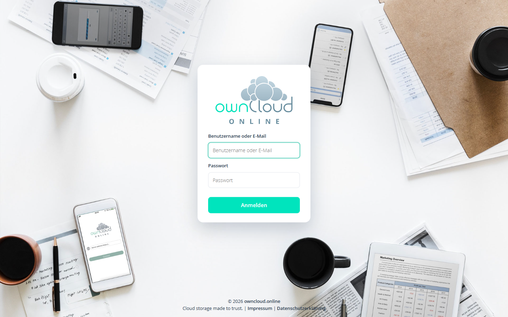
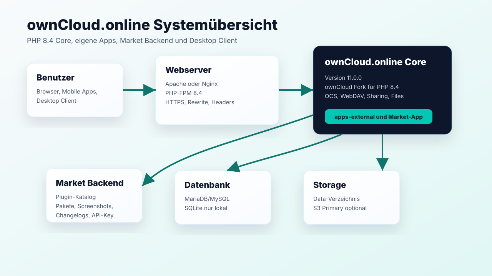

# ownCloud.online Dokumentation

ownCloud.online ist ein Fork von ownCloud Server mit Zielplattform PHP 8.4. Diese Dokumentation beschreibt Installation, Betrieb, Updates, eigene Plugins, Market-Backend und Desktop-Client-Kompatibilität.



## Stand dieser Dokumentation

| Bereich | Stand |
| --- | --- |
| Server-Version | `11.0.0.0`, Versionstring `11.0.0` |
| PHP-Zielversion | PHP 8.4 |
| Repository | `https://github.com/BWTECH-github/owncloud.online` |
| Lokaler Testserver | `http://127.0.0.1:8088` |
| Market Backend lokal | `http://127.0.0.1:8090` |
| Desktop Client Testbuild | `owncloud.online 7.2.0-git` |

## Dokumentationsbereiche

- **Installation**: leerer Linux-Server, Webhosting ohne Root-Rechte und lokale WSL-Installation.
- **Administration**: Sicherheit, Cron, Cache, Apps, Backups, Updates und Troubleshooting.
- **Benutzer**: Dateien, Freigaben, WebUI und Desktop Client.
- **Plugins**: geprüfte Apps, Paketbau, Marketplace und Update-Ablauf.
- **Entwickler**: Release-Prozess, PHP-8.4-Regeln und Tests.

## Architektur



## Quellen und Abgrenzung

Diese Dokumentation beschreibt owncloud.online: PHP 8.4, die BW-Tech
Release-Tools und die eigenen Plugin-Repositories. Sie ist eigenständig — was
hier steht, gilt für diesen Server und wurde daran geprüft.

- owncloud.online Repository: <https://github.com/BWTECH-github/owncloud.online>
- Release Tools lokal: `C:\git\owncloud-online-release-tools`
- Market Backend lokal: `C:\git\market-backend`

## Lokale Testdaten

Beim Einrichten legen Sie das Administratorkonto selbst an:

```text
Benutzer: admin
Passwort: <eigenes Passwort wählen>
```

Wählen Sie auch für eine reine Testinstanz ein zufälliges Passwort und
verwenden Sie es nirgends erneut. Testinstanzen sind erfahrungsgemäß schneller
aus dem lokalen Netz erreichbar als geplant, und ein Passwort aus einer
Anleitung steht in jeder Wörterbuchliste.
