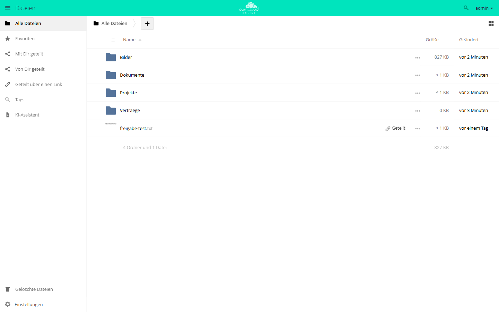

# Lokale Entwicklung mit WSL

Für lokale Tests wird Windows mit WSL2 verwendet.

## WSL2 prüfen

```powershell
wsl --set-default-version 2
wsl -l -v
```

Ubuntu muss mit `VERSION 2` laufen.

## Server starten

```powershell
wsl --cd /mnt/c/git/owncloud.online php8.4 -S 127.0.0.1:8088 -t .
```

Browser:

```text
http://127.0.0.1:8088
```

## Lokale Admin-Daten

```text
Benutzer: admin
Passwort: AdminWorkflow2026Local
```

## Basischecks

```powershell
curl http://127.0.0.1:8088/status.php
wsl bash -lc "cd /mnt/c/git/owncloud.online && php8.4 occ status"
wsl bash -lc "cd /mnt/c/git/owncloud.online && php8.4 occ app:list"
```

## Lokale Ansicht


