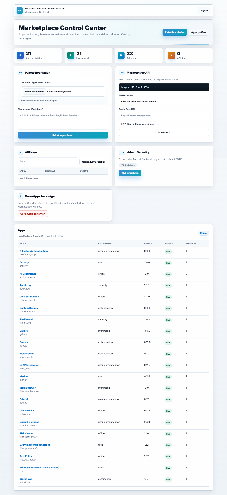
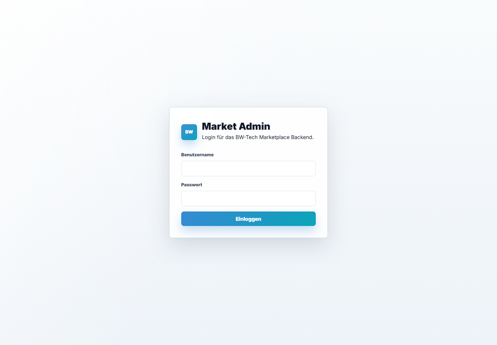

# Market Backend

Das Market Backend verwaltet eigene App-Pakete und stellt eine ownCloud-kompatible Marketplace-API bereit.



## Lokaler Start

```bash
cd /mnt/c/git/market-backend
php8.4 bin/setup.php --admin admin --password '<entfernt>'
php8.4 bin/import-packages.php /mnt/c/git/_plugin_packages/packages
php8.4 bin/remove-core-apps.php
php8.4 -S 0.0.0.0:8090 -t public
```

Admin UI:

```text
http://127.0.0.1:8090/admin
```



## Funktionen

- `.tar.gz` App-Pakete hochladen.
- Updates mit Changelog pro Release pflegen.
- Screenshots als Datei oder URL hinterlegen.
- API-Key für Katalogzugriff erzwingen.
- Core-Apps aus dem Katalog entfernen.
- Kategorien, Sichtbarkeit und Trust-Level pflegen.

## API

```text
GET /api/v1/platform/{version}/apps.json
GET /api/v1/categories.json
```

In ownCloud.online wird die URL als `appstoreurl` gesetzt.

## Produktivbetrieb

Für Produktion:

- PHP 8.4-FPM verwenden.
- Nginx oder Apache als Reverse Proxy einsetzen.
- `public/` als DocumentRoot setzen.
- `storage/` nicht direkt ausliefern.
- Admin-Passwort ändern.
- HTTPS erzwingen.
- Backup der SQLite-Datenbank einrichten.
